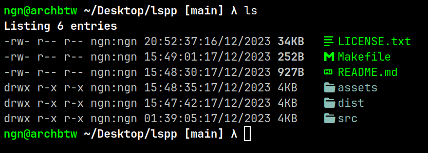
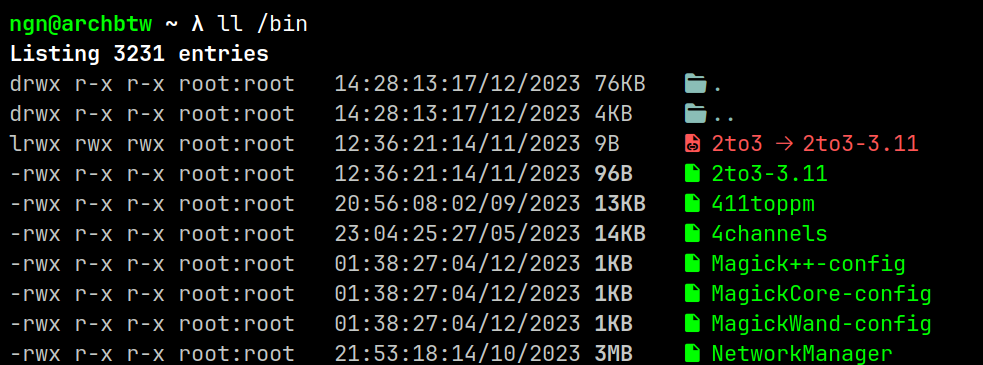

# lspp - ls plus plus
a minimal alternative to coreutils' `ls` command. 

### installation
lspp uses [nerd fonts](https://www.nerdfonts.com), so go ahead and install that first

after installing nerd fonts, clone this repository:
```bash
git clone https://github.com/ngn13/lspp.git
```
run the make script (make sure you have `gcc` installed):
```bash
make
```
and finally run the install script as **root**:
```bash
make install
```

### usage
run `lspp -h` to list the usage and the options.
adding an alias to your `~/.bash` or `~/.zshrc` (or whatever shell you are using)
file would make `lspp` easier to use:
```bash 
alias l="lspp -l"
alias ll="lspp -a"
```

### screenshots



### contribute 
you can easily contribute by adding new icons, see the [`icons.c`](src/icons.c) file,
you can find icons with the [nerdfonts cheat sheet](https://www.nerdfonts.com/cheat-sheet)
